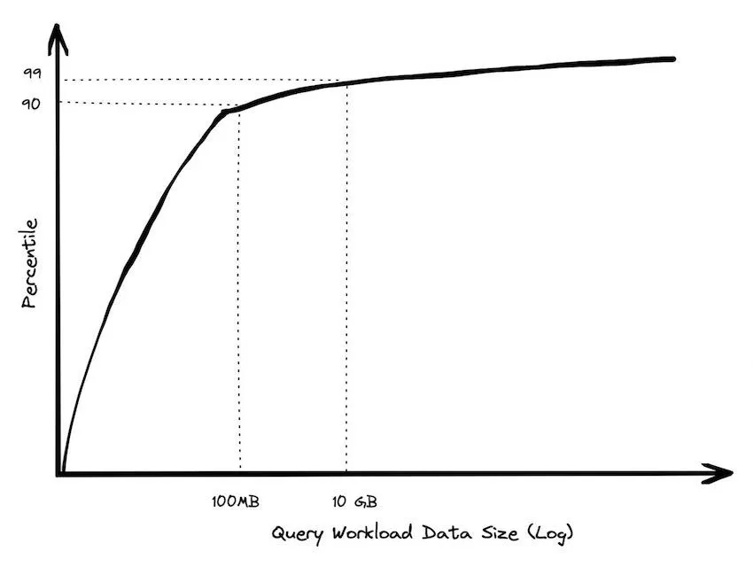

# 

:::{.newsection}
Banner title of the new section
:::

## Basic slide with source citation


A regular content slide. The heading separator rule is injected automatically by `heading-rule.lua`.

- List markers use a small chevron "›"  in warm red
- Body font is **Fira Sans**; headings use **Zilla Slab**
- Link color is warm red: <https://quarto.org>
- Code text in dark purple

## Two-column layout<br>with two-line heading

:::: {.columns}
::: {.column width="50%"}
**Left column**

Use Quarto's native column syntax for side-by-side content.

- Point one
- Point two
- Point three
:::
::: {.column width="50%"}
**Right column**

Both columns share the same slide background and typography settings from `_brand.yml`.
:::
::::

## Code blocks

```python
def greet(name: str) -> str:
    """Return a greeting string."""
    return f"Hello, {name}!"

print(greet("Mozilla"))
```

Inline code also uses Fira Code: `quarto render example.qmd`

## Table styling

| Feature | Mechanism | File |
|:--------|:----------|:-----|
| Background colour | `_brand.yml` semantic role | `_brand.yml` |
| Fonts | `_brand.yml` typography | `_brand.yml` |
| Heading rule | Lua AST filter | `heading-rule.lua` |
| Source citation | Lua shortcode | `source.lua` |
| Title slide | Pandoc partial | `title-slide.html` |

## Blockquote styling

> The internet is a global public resource that must remain open and accessible to all.

— Mozilla Manifesto, Principle 2

## Card grid — 3 columns (default)

::: {.card-grid}
::: {.card}
**Brand layer**

Colours, fonts, logo and semantic roles live in `_brand.yml`. This is the single source of truth.
:::
::: {.card}
**SCSS layer**

Sizing, layout and components not expressible in `_brand.yml` go in `mozilla.scss`.
:::
::: {.card}
**Lua filters**

AST manipulation only when standard Quarto features and SCSS are insufficient.
:::
:::

## Card grid — 2 columns {.cols-2}

::: {.card-grid .cols-2}
::: {.card}
**Quarto features first**

Always reach for built-in Quarto options before adding custom code.
:::
::: {.card}
**Keep it simple**

Every layer of customisation adds maintenance burden. Less is more.
:::
:::

## Full background image slide {background-image="images/talking-to-ai.jpg" background-opacity="0.5"}

Content rendered over a background image.

Use `background-opacity` to control how visible the image is.

## Dark background slide {background-color="#111111"}

On dark-background slides, Quarto adds `.has-dark-background` to the section.

Links and source citations adapt automatically:

- [Warm-red link](https://mozilla.org) lightens by 15% for contrast
- Source text uses `rgba(255,255,255,0.75)`
- Heading rule uses `rgba(255,255,255,0.6)`



## Two-line heading for longer titles<br>that need a second line


You can break any heading across two lines with `<br>` in the heading text.

The heading rule always spans the full slide width beneath the heading.

## Figures - with or without caption - are center-aligened by default

